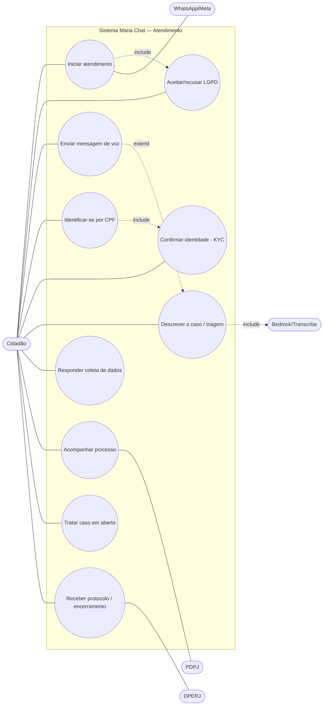
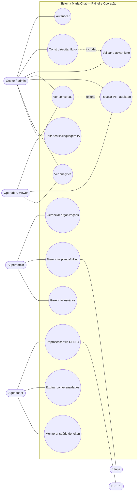

# Maria Chat — Casos de Uso

> Atores, catálogo de casos de uso e especificação dos principais.
> Diagramas em Mermaid (aproximação da notação UML de caso de uso: fronteira do
> sistema como caixa, casos de uso como elipses, atores nas laterais).

---

## 1. Atores

| Ator | Tipo | Descrição |
|---|---|---|
| **Cidadão** | primário | Assistido que busca atendimento (WhatsApp/web). |
| **Gestor (admin)** | primário | Configura fluxos, vê conversas/analytics, revela PII. |
| **Operador (viewer)** | primário | Acesso de leitura ao painel; revelar PII é auditado. |
| **Superadmin** | primário | Gerencia organizações, planos e usuários (multi-tenant). |
| **Agendador** | primário (tempo) | Dispara jobs periódicos (retry, limpeza, health). |
| **WhatsApp/Meta** | secundário | Canal de mensagens. |
| **PDPJ** | secundário | Consulta de processos judiciais. |
| **DPERJ** | secundário | Sistema interno que recebe o atendimento. |
| **Bedrock / Transcribe** | secundário | IA (LLM/RAG) e transcrição de áudio. |
| **Stripe** | secundário | Cobrança dos planos. |

---

## 2. Diagrama — Atendimento (Cidadão)

## 3. Diagrama — Painel e Operação (Gestor / Superadmin / Agendador)

---

## 4. Catálogo de casos de uso

| ID | Nome | Ator principal | Descrição |
|---|---|---|---|
| UC-01 | Iniciar atendimento | Cidadão | Abre conversa por WhatsApp/web; sistema saúda e inicia o fluxo. |
| UC-02 | Aceitar/recusar LGPD | Cidadão | Consente com o termo antes de coletar dados; recusa encerra. |
| UC-03 | Enviar mensagem de voz | Cidadão | Manda áudio; sistema transcreve (pt-BR) e trata como texto. |
| UC-04 | Identificar-se por CPF | Cidadão | Informa CPF; sistema consulta/cadastra/atualiza o assistido. |
| UC-05 | Confirmar identidade (KYC) | Cidadão | Faz selfie por link; sistema confirma e retoma o WhatsApp. |
| UC-06 | Descrever o caso (triagem) | Cidadão | Relata o problema; IA classifica o serviço (RAG). |
| UC-07 | Responder coleta de dados | Cidadão | Responde perguntas do serviço + dados pessoais/contato. |
| UC-08 | Acompanhar processo | Cidadão | Consulta processos no PDPJ, escolhe e recebe resumo do status. |
| UC-09 | Tratar caso em aberto | Cidadão | Sistema detecta casos abertos e pergunta se quer tratar. |
| UC-10 | Receber protocolo/encerramento | Cidadão | Recebe protocolo da DPERJ (ou encerramento degradado). |
| UC-20 | Autenticar no painel | Gestor/Operador/Superadmin | Login por JWT. |
| UC-21 | Construir/editar fluxo | Gestor | Monta o fluxo no construtor visual. |
| UC-22 | Validar e ativar fluxo | Gestor | Valida (estrutura + compilação) e ativa o fluxo. |
| UC-23 | Ver conversas | Gestor/Operador | Lista conversas com resumo, dados (mascarados) e histórico. |
| UC-24 | Revelar PII | Gestor/Operador | Revela dado sensível sob demanda; registra auditoria. |
| UC-25 | Ver analytics | Gestor/Operador | Métricas agregadas de atendimento. |
| UC-26 | Editar estilo/linguagem da IA | Gestor | Ajusta o preâmbulo global de tom/linguagem. |
| UC-30 | Gerenciar organizações | Superadmin | CRUD de organizações (multi-tenant). |
| UC-31 | Gerenciar planos/billing | Superadmin | Planos free/pro/enterprise; checkout/webhook Stripe. |
| UC-32 | Gerenciar usuários | Superadmin | CRUD de operadores e papéis. |
| UC-40 | Reprocessar fila DPERJ | Agendador | Reenvia payloads que falharam. |
| UC-41 | Expirar conversas/dados | Agendador | Expira conversas inativas e dados efêmeros (ficha/áudio). |
| UC-42 | Monitorar saúde do token | Agendador | Verifica validade do token do WhatsApp e alerta. |

---

## 5. Especificação dos principais

### UC-01 — Iniciar atendimento (+ LGPD)
- **Ator:** Cidadão · **Pré:** número/canal ativo · **Pós:** fluxo iniciado ou encerrado.
- **Fluxo principal:**
  1. Cidadão envia a primeira mensagem.
  2. Sistema responde 200 imediato, enfileira e saúda.
  3. Sistema apresenta o termo LGPD (**«include» UC-02**).
  4. Cidadão aceita.
  5. Sistema segue para identificação (UC-04).
- **Alternativos:**
  - 4a. Recusa LGPD → sistema encerra sem coletar dados (RN-01).
  - 2a. Reentrega da Meta (mesmo message id) → sistema ignora (idempotência).

### UC-05 — Confirmar identidade (KYC facial)
- **Ator:** Cidadão · **Pré:** CPF informado · **Pós:** identidade confirmada.
- **Fluxo principal:**
  1. Sistema envia link do KYC.
  2. Cidadão abre e envia a selfie.
  3. Serviço KYC confirma (score) e retoma o WhatsApp automaticamente.
  4. Sistema segue o fluxo.
- **Alternativos:**
  - 3a. Selfie não confirma → sistema orienta nova tentativa.

### UC-08 — Acompanhar processo (PDPJ + resumo IA)
- **Ator:** Cidadão · **Secundário:** PDPJ, Bedrock · **Pré:** CPF conhecido.
- **Fluxo principal:**
  1. Sistema consulta processos por CPF no PDPJ.
  2. Sistema lista os processos (pergunta fixa).
  3. Cidadão escolhe (número ou índice).
  4. Sistema busca o detalhe e gera resumo do status em linguagem simples.
  5. Sistema envia o resumo.
- **Alternativos:**
  - 1a. Sem processo / token expirado (401) → segue sem listar (degrada, RNF-06).

### UC-21/UC-22 — Construir, validar e ativar fluxo
- **Ator:** Gestor · **Pré:** autenticado (admin) · **Pós:** fluxo ativo.
- **Fluxo principal:**
  1. Gestor edita nós/arestas no construtor visual.
  2. Gestor salva.
  3. Sistema valida (estrutura + compilação) (**«include» UC-22**).
  4. Gestor ativa; sistema passa a usar o fluxo por organização.
- **Alternativos:**
  - 3a. Validação falha → sistema aponta os erros; ativação bloqueada.

### UC-24 — Revelar PII (auditado)
- **Ator:** Gestor/Operador · **Pré:** conversa selecionada · **Pós:** PII exibida + log.
- **Fluxo principal:**
  1. Operador solicita revelar um dado mascarado.
  2. Sistema registra auditoria (usuário, alvo, data).
  3. Sistema retorna o dado sem máscara.
