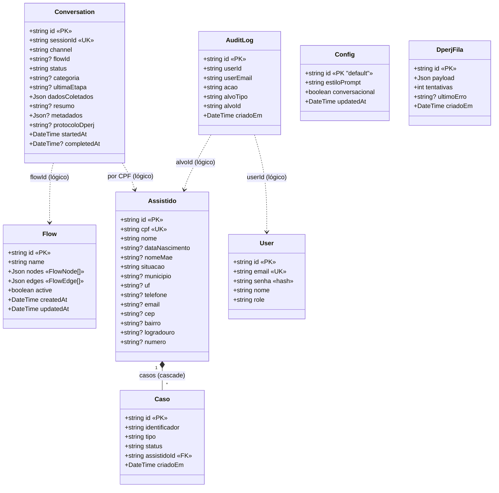
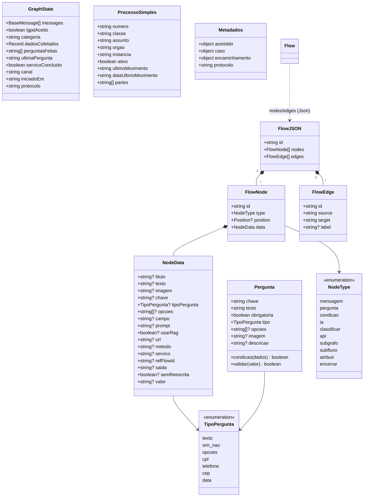
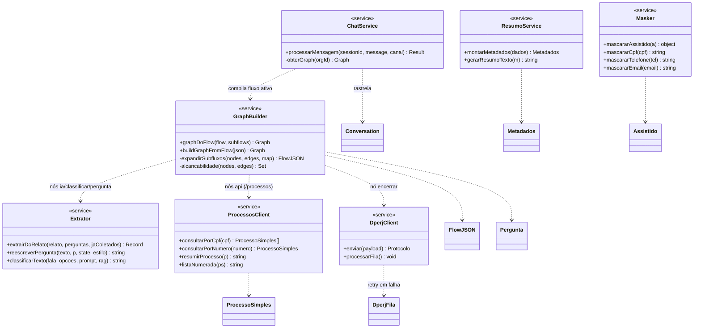

# Maria Chat — Diagrama de Classes

> Modelo de classes/tipos do domínio. Três recortes: entidades persistentes
> (Prisma), tipos do motor de fluxo e serviços (módulos com operações).
> Notação UML em Mermaid `classDiagram`. `-->` associação, `*--` composição,
> `..>` dependência/referência lógica (sem FK física).

---

## 1. Entidades persistentes (Prisma)

> Fora do Prisma: schema `langgraph` (checkpoints/checkpoint_writes/checkpoint_blobs)
> guarda o estado das conversas por `thread_id` — gerenciado pelo LangGraph.

---

## 2. Motor de fluxo (tipos)

---

## 3. Serviços (módulos com operações)

