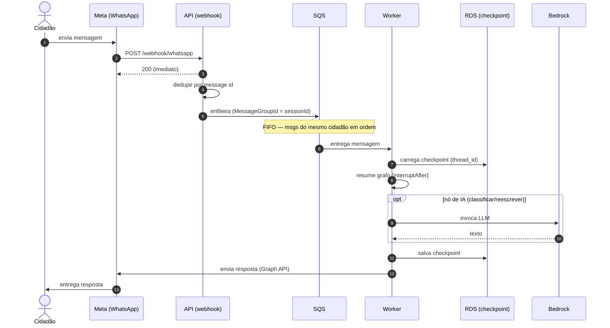
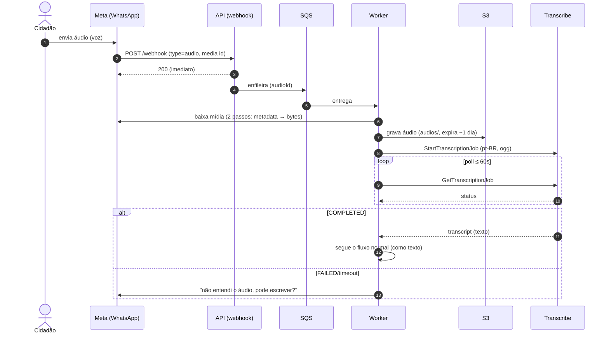
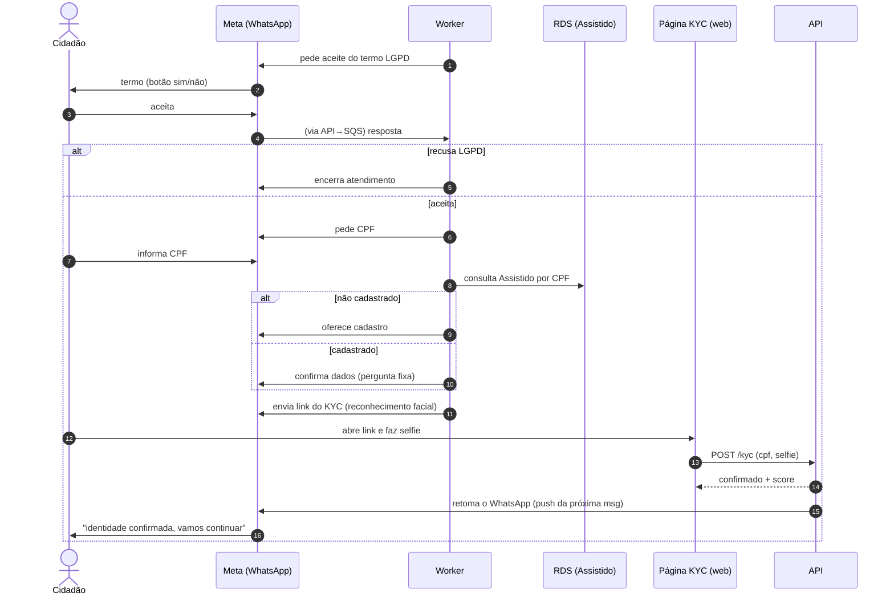
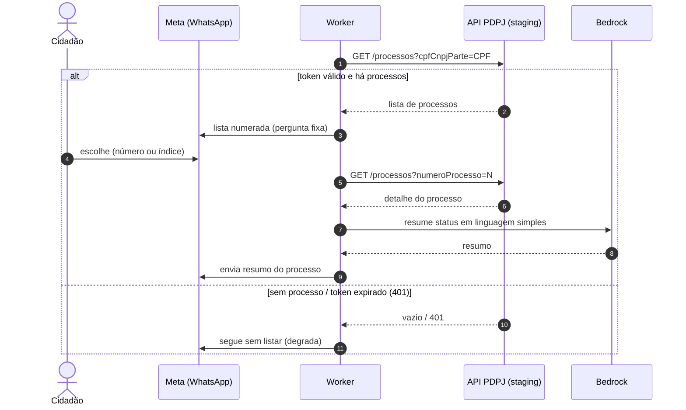
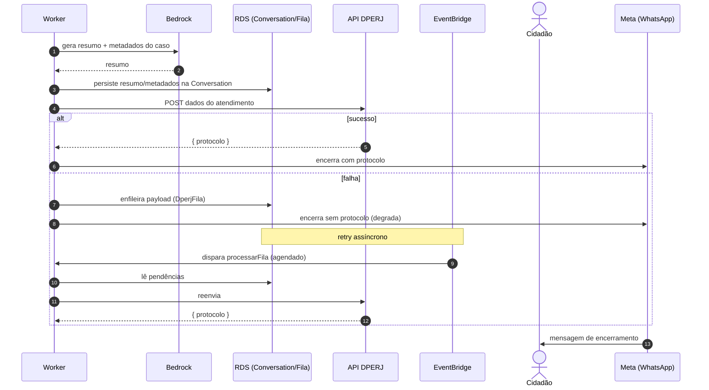

# Maria Chat — Diagramas de Sequência

> Fluxos críticos do atendimento, na arquitetura-alvo (Fargate api + SQS + worker).
> Renderizam como imagem no GitHub, VS Code (extensão Mermaid) ou mermaid.live.
> Para exportar PNG/SVG: colar cada bloco em https://mermaid.live.

Participantes recorrentes: **Cidadão**, **Meta** (WhatsApp Cloud API),
**API** (Fargate api/webhook), **SQS**, **Worker** (Fargate/LangGraph),
**RDS** (Postgres/checkpoints), **Bedrock**, **KB** (RAG), **Transcribe**,
**S3**, **PDPJ**, **DPERJ**.

---

## 1. Mensagem de texto → resposta (caminho principal)

---

## 2. Mensagem de voz (áudio) → transcrição → fluxo

---

## 3. Onboarding: LGPD → CPF → identidade (KYC facial)

---

## 4. Consulta de processo (tema Acompanhar Processo) — PDPJ + resumo IA

---

## 5. Encerramento → envio à DPERJ (com fila de retry)

