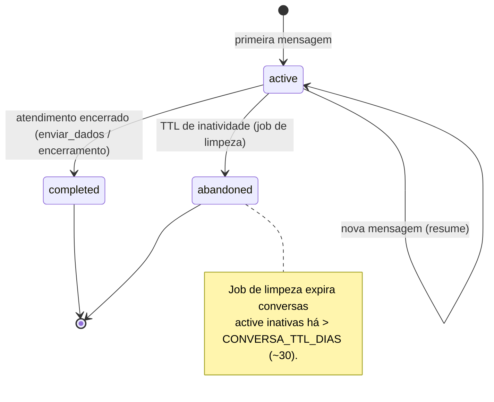
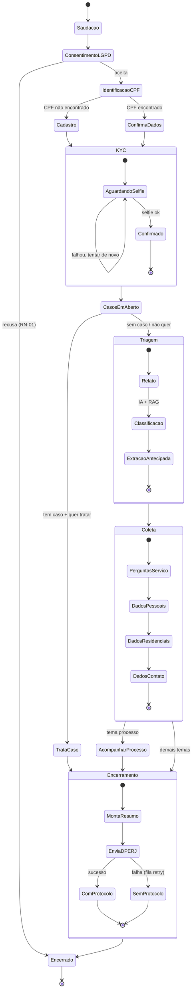
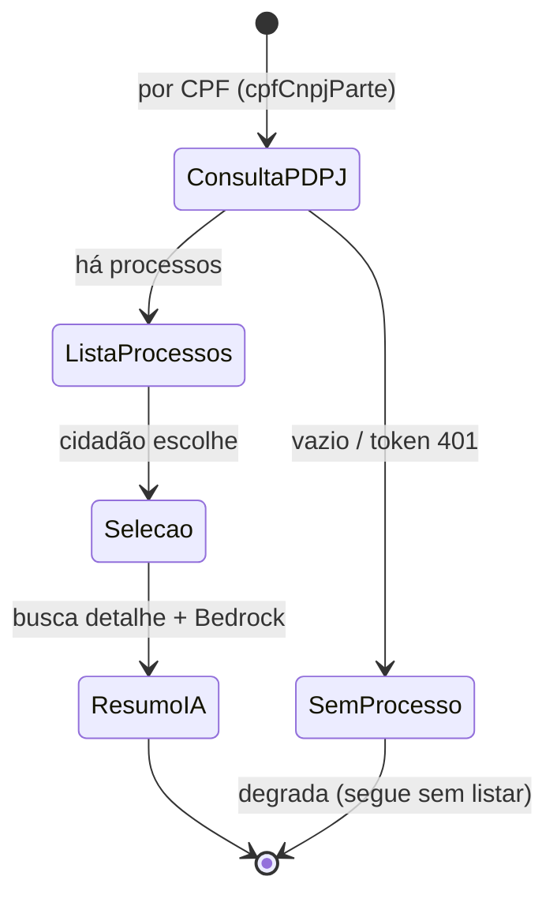
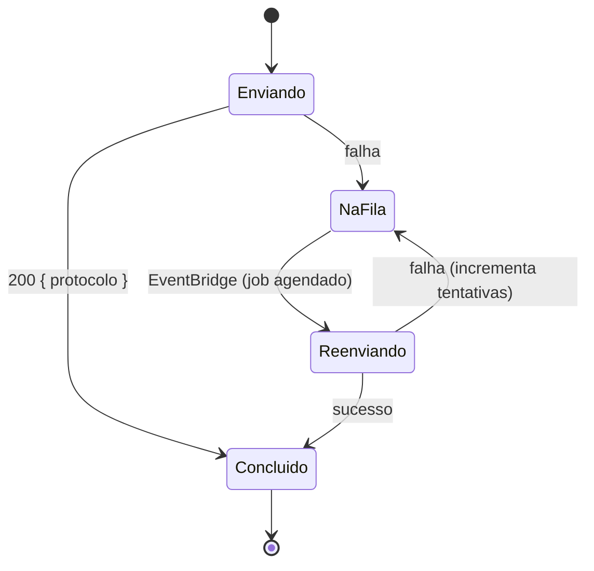

# Maria Chat — Máquinas de Estado

> Estados do ciclo de vida da conversa (campo `Conversation.status`), do macro-
> fluxo de atendimento e do subfluxo de KYC. Notação Mermaid `stateDiagram-v2`.

---

## 1. Ciclo de vida da Conversation (`status`)

Valores reais do campo: `active` | `completed` | `abandoned`.

---

## 2. Macro-fluxo do atendimento (fluxo DPERJ completo)

Estados de negócio percorridos pelo cidadão. Cada `[INTERRUPT]` pausa aguardando
resposta (padrão multi-turn do LangGraph).

---

## 3. Subfluxo — Acompanhar Processo (PDPJ)

---

## 4. Retry de envio à DPERJ (fila)

---

## Mapeamento estado → campo persistido

| Máquina | Onde é observável |
|---|---|
| Conversation.status | `Conversation.status` (active/completed/abandoned) |
| Macro-fluxo | posição no checkpoint LangGraph + `Conversation.ultimaEtapa` |
| Dados coletados por estado | `Conversation.dadosColetados` / `GraphState.dadosColetados` |
| Encerramento | `Conversation.protocoloDperj`, `resumo`, `metadados`, `completedAt` |
| Fila DPERJ | `DperjFila` (payload, tentativas) |
